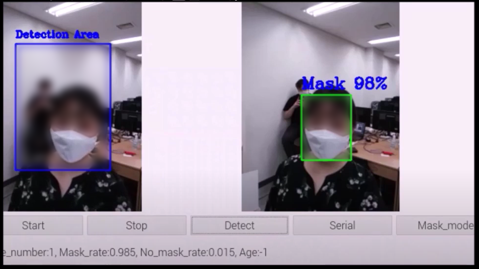

# 2020ESWContest_free_1114

2020 임베디드 SW 경진대회 1114번 거기잠깐마스크쓰시죠 팀의 제출 소스코드입니다. 라즈베리파이 카메라와 마스크 착용탐지 및 나이추정 딥러닝 모델을 사용하여 탑승여부를 확인하고 MicroController와 연동하여 개찰구를 통제할수 있도록 개발되었습니다.

## Features
* 백쓰레드로 카메라의 실시간 이미지 출력 및 Arudino와 Raspberry Pi간의 시리얼 통신을 지원합니다.
* 딥러닝 모델은 Face Detector, Mask Detector, Age Estimator로 구성되어 있습니다.
* 개별의 RFID 카드를 인식하며, 인식된 경우 캠과 연동하여 딥러닝 모델에 입력하여 결과를 실시간으로 출력합니다.
* 마스크를 쓴 경우 Face Detector -> Mask Detector 순으로 연산하고, 쓰지 않은경우 Face Detector -> Mask Detector -> Age Estimator에 의해 연산됩니다.
* 통과 조건이 충족된 경우 Arudino 통신을 통해 모터를 작동시키고 문을 열게 됩니다.
* 문이 열린경우 초음파센서로 사람이 통과하였는지 탐지합니다.

# Arduino

## 필요 라이브러리

* MFRC522.h
* SPI.h
  
# Raspbery Pi

## 필요 라이브러리

* Python >= 3.7
* OpenCv >= 4.1
* Tensorflow >= 2.2
* Numpy
* PyQt5
* PySerial

  
